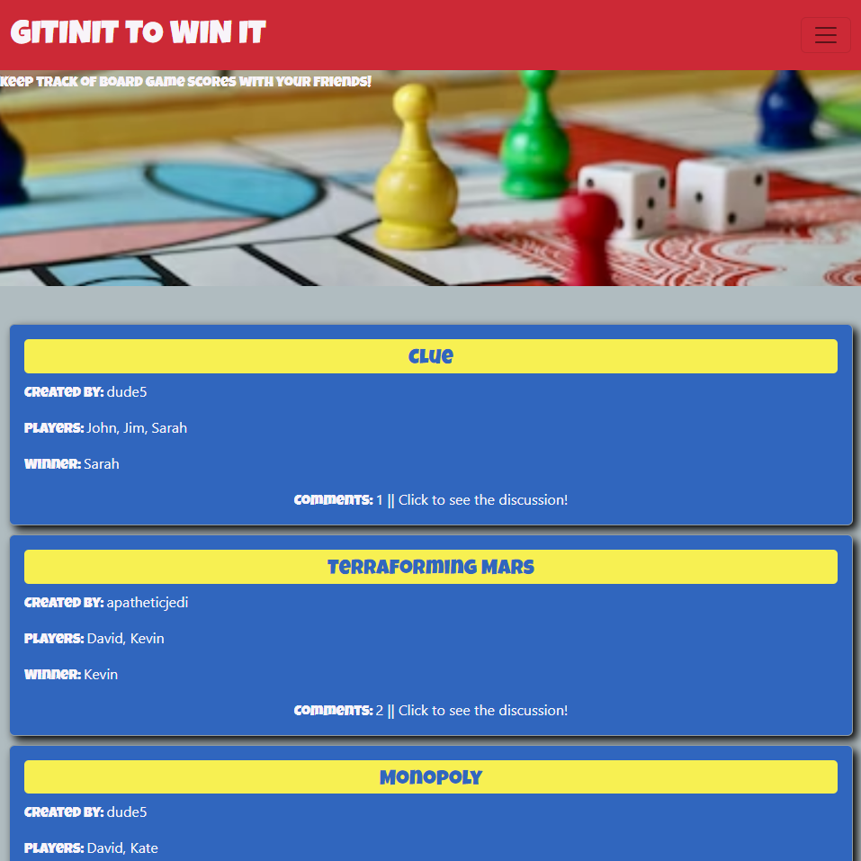

# [GitInit to Win It](https://github.com/frieskevin/board-game-tracker)

## [View the Deployed Application Here](https://blooming-reef-74951.herokuapp.com/)

### Table of Contents

1. [Description](#description)
2. [Built With](#built-with)
3. [Installation](#installation)
4. [Usage](#usage)
5. [Contributing](#contributing)
6. [Acknowledgments](#acknowledgments)

## Description

This is a single-page application that allows users to track statistics from their board gaming sessions. Statistics include the game title, players, score, winner, and any additional notes. Once a board game session is posted, other users can add comments to the game. This app was made using the full MERN Stack and is deployed using Heroku.

### Built With

* JavaScript
* HTML
* CSS
* React
* Node.js 

## Installation

If you wish to install this application locally, clone this repo, then type 
~~~ 
npm i 
~~~ 
in the root directory to install all dependencies. Then, in the root folder, type 
~~~
npm run build
~~~
then
~~~ 
npm run develop 
~~~ 
to start the local server and open the web page. 

(<a href="#top">back to top</a>)

## Usage

[View the deployed application here.](https://blooming-reef-74951.herokuapp.com/) To use the application, click the Sign Up link to create an account, or Login if you have already created one. On the homepage, view all games posted and click on an individual one to add a comment. In the header, click Dashboard to go to your page where you can click the Add Game button to create a new game session. After filling in all the fields, click Add Game to submit. The game session will then display in the Dashboard and Main pages.

## Contributing

The following GitHub users contributed to this application:

* [frieskevin](https://github.com/frieskevin)
* [Rosepetal2022](https://github.com/Rosepetal2022)
* [llacourciere](https://github.com/llacourciere)
* [apatheticjedi](https://github.com/apatheticjedi)

(<a href="#top">back to top</a>)

## Acknowledgments

* [Reactstrap](https://deploy-preview-2356--reactstrap.netlify.app/)
* [MongoDB](https://www.mongodb.com/home)
* [Mongoose](https://mongoosejs.com/)
* [Concurrently](https://www.npmjs.com/package/concurrently)
* [GraphQL](https://graphql.org/)
* [Express](https://expressjs.com/)
* [Apollo Server/Apollo Client](https://www.apollographql.com/)
* [bcrypt](https://www.npmjs.com/package/bcrypt)
* [JWT](https://jwt.io/)
* [Heroku](https://www.heroku.com/)

## License

[MIT License](https://spdx.org/licenses/MIT.html)

(<a href="#top">back to top</a>)

